---
title: "Midterm Presentation"
author: <font size="5"> Ryan Walsh </font>
output:
  xaringan::moon_reader:
    css: [default, metropolis, metropolis-fonts]
    lib_dir: libs
    nature:
      highlightStyle: github
      highlightLines: true
      countIncrementalSlides: false
      slideNumberFormat: |
        <div class="progress-bar-container">
          <div class="progress-bar" style="width: calc(%current% / %total% * 100%);">
          </div>
        </div>`
---

<style>

.remark-slide-content {
  background-color: #FFFFFF;
  border-top: 80px solid #F9C389;
  font-size: 17px;
  font-weight: 300;
  line-height: 1.5;
  padding: 1em 2em 1em 2em
}

.inverse {
  background-color: #696767;
  border-top: 80px solid #696767;
  text-shadow: none;
  background-image: url(https://github.com/goodekat/presentations/blob/master/2019-isugg-gganimate-spooky/figures/spider.png?raw=true);
	background-position: 50% 75%;
  background-size: 150px;
}

.your-turn{
  background-color: #8C7E95;
  border-top: 80px solid #F9C389;
  text-shadow: none;
  background-image: url(https://github.com/goodekat/presentations/blob/master/2019-isugg-gganimate-spooky/figures/spider.png?raw=true);
	background-position: 95% 90%;
  background-size: 75px;
}

.title-slide {
  background-color: #F9C389;
  border-top: 80px solid #F9C389;
  background-image: none;
}

.title-slide > h1  {
  color: #111111;
  font-size: 40px;
  text-shadow: none;
  font-weight: 400;
  text-align: left;
  margin-left: 15px;
  padding-top: 80px;
}
.title-slide > h2  {
  margin-top: -25px;
  padding-bottom: -20px;
  color: #111111;
  text-shadow: none;
  font-weight: 300;
  font-size: 35px;
  text-align: left;
  margin-left: 15px;
}
.title-slide > h3  {
  color: #111111;
  text-shadow: none;
  font-weight: 300;
  font-size: 25px;
  text-align: left;
  margin-left: 15px;
  margin-bottom: -30px;
}

</style>

```{css, echo=FALSE}
.left-code {
  color: #777;
  width: 40%;
  height: 92%;
  float: left;
}
.right-plot {
  width: 59%;
  float: right;
  padding-left: 1%;
}
```

```{r setup, include = FALSE}

# R markdown options
knitr::opts_chunk$set(echo = TRUE, 
                      cache = TRUE, 
                      fig.width = 10,
                      fig.height = 5,
                      fig.align = "center", 
                      message = FALSE, 
                      warning = FALSE)

# Load packages
library(gapminder)
library(gganimate)
library(ggplot2)
library(tidyverse)
library(lubridate)
library(knitr)

```

# Defining sex and providers


```{r,eval=FALSE}
df1$sex1 <- case_when(df1$sex == 1 ~ 'male',
                      df1$sex == 2 ~ 'female', 
                      df1$sex == 9 ~'Other')
```


```{r,eval=FALSE}
df1$provider1 <- case_when(df1$provider == 7201 ~ "Newport", df1$provider == 7202 ~ "St. Joseph Health Services of RI",df1$provider == 7203 ~ "Memorial",df1$provider == 7204 ~ "Miriam",df1$provider == 7205 ~ "Rhode Island Hospital",df1$provider == 7206 ~ "Roger Williams",df1$provider == 7209 ~ "South County",df1$provider == 7210 ~ "Kent County",df1$provider == 7211 ~ "Westerly",df1$provider == 7212 ~ "Rehab of RI",df1$provider == 7213 ~ "Landmark Medical Center",df1$provider == 7214 ~ "Women and Infants",df1$provider == 7215 ~ "Bradley",df1$provider == 7216 ~ "Butler",)
```

---
# Dispotion by Sex

.left-code[
```{r, eval=FALSE}
m8 <- df1 %>% filter(dispub92 %in% c("01","02","03","04","05","09","20","50","51","62","65","70")) %>% ggplot(aes(x = dispub92, color = sex1))+
  geom_bar()+
  labs(x = "status/location of patient(Disposition)",y = "Count",title = 'Bar graph of frequency of discharges stratified by sex', caption = "The top 12 dispositions for individuals. The most frequent appears to be a Routine discharge(01) to home or self care.")
ggsave(filename = 'Dispotion.png', plot = m8)
m8
```


]
.right-plot[
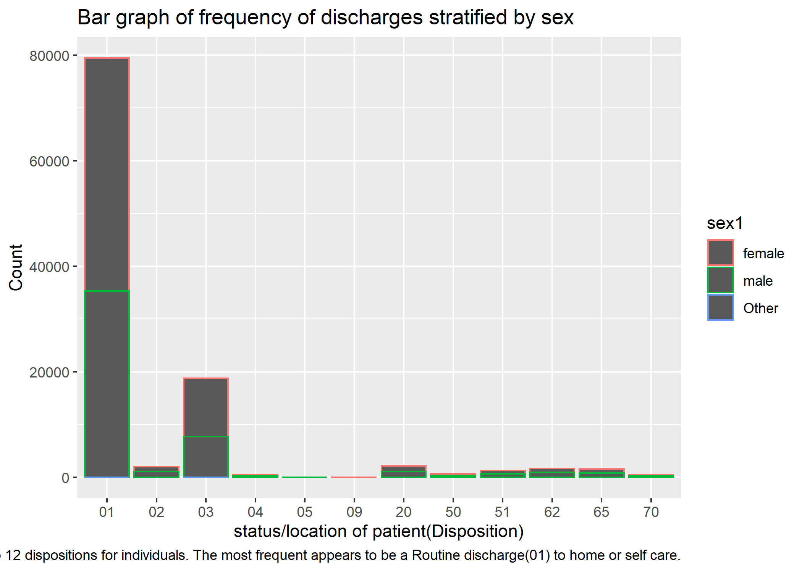
]

---
# Total Expenses by Age and Sex

.left-code[
```{r,eval=FALSE}
m6 <- df1 %>% ggplot() + geom_point(mapping=aes(x=age, y=tot)) + facet_wrap(~sex1) +
  labs(x='Age', 
       y = 'total expenses', 
       title = 'total expenses by Age and sex', 
       caption = 'Once again we see indiviudals who are young(< 10 years old) accounting for some of our highest expenses, due to their long lenth of stay as well this makes sense that their total expenses are more.')
ggsave(filename = 'AgevTot.png', plot = m6)
m6
```
]
.right-plot[
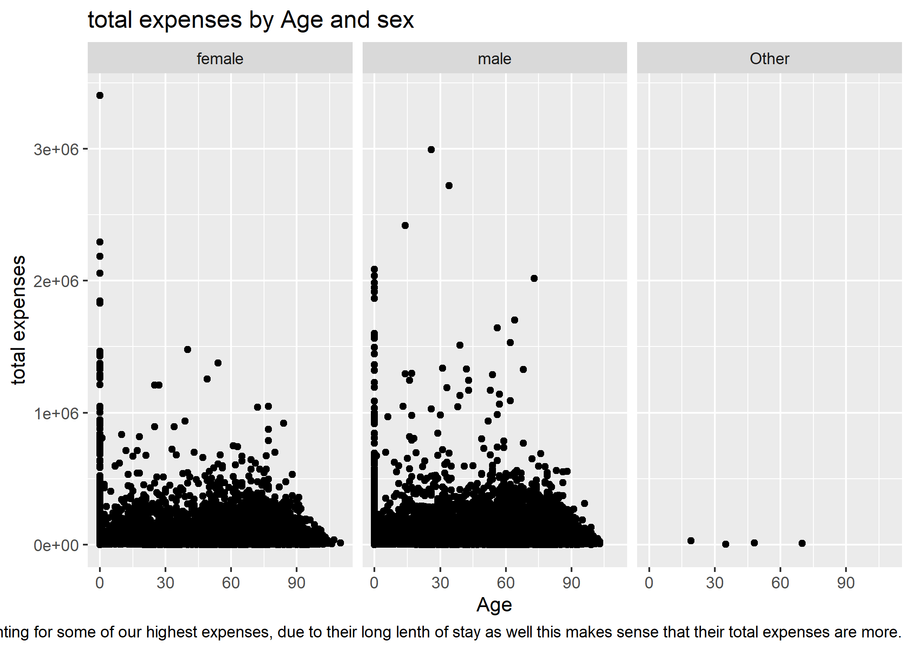
]

---
# Length of stay by Age

.left-code[
```{r,eval=FALSE}
library(ggplot2)
m7 <- df1 %>% ggplot() + geom_point(mapping=aes(x=age, y=los)) + facet_wrap(~sex1) +
  labs(x='Age', 
       y = 'Length of Stay', 
       title = 'Length of Stay by Age and Sex', 
       caption = 'On average younger people seem to stay in the hospital longer than old people. It should be noted the data we see for other makes sense due to the lack of observation. ')
m7
ggsave(filename = 'AgevLos.png', plot = m7)
```
]
.right-plot[
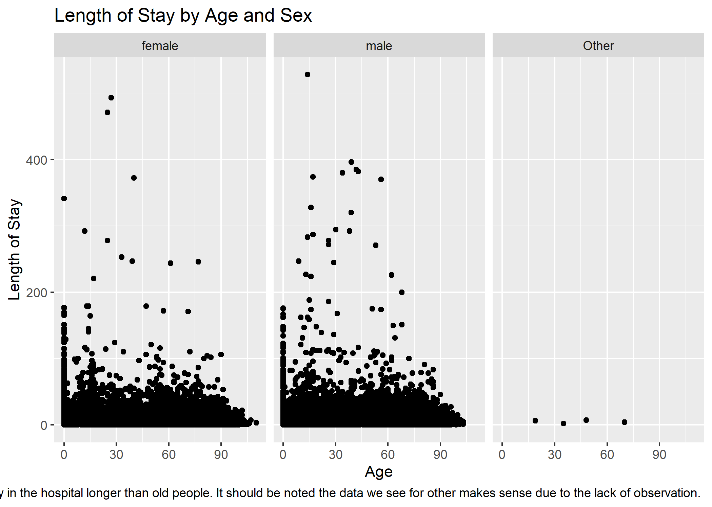
]
---
# Length of stay by provider

.left-code[
```{r,eval=FALSE}
library(ggplot2)
m5 <- df1 %>% ggplot() + geom_point(mapping=aes(x=los, y=tot)) + facet_wrap(~provider1) +
  labs(x='Length of Stay', 
       y = 'Total Charge', 
       title = 'Total Charge by Length of Stay and Provider', 
       caption = 'Rhode Island Hospital and Woman and Infants appear to have the most data, the woman and infants appear to charge at a more extreame rate if we were to run a linear regression to predict price from length of stay')
ggsave(filename = 'LosProv.png', plot = m5)
m5
```
]
.right-plot[
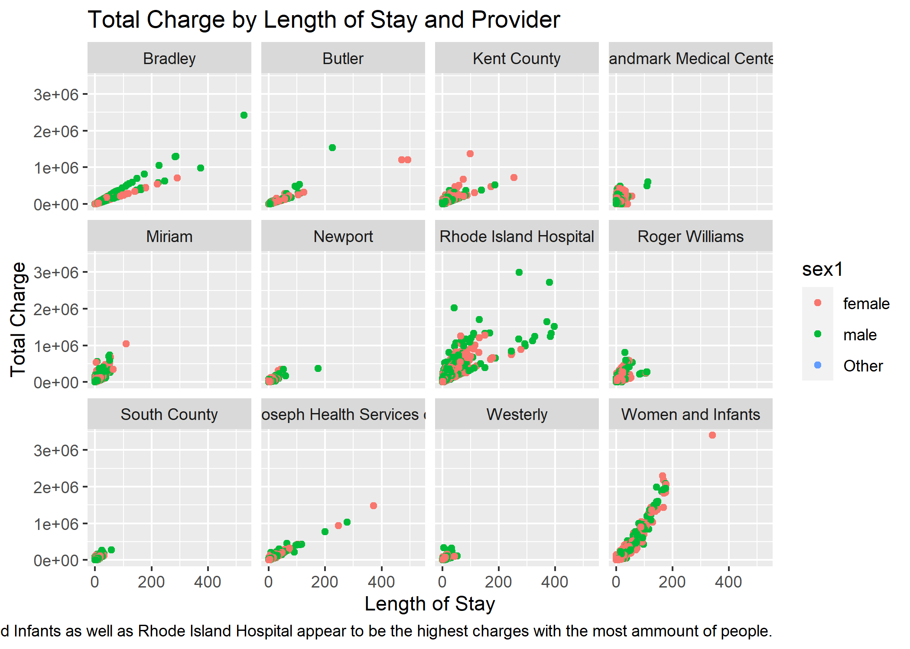
]
---
# Total expenses by provider and gender for teenagers

.left-code[
```{r,eval=FALSE}
#teenagers
m4 <- df1 %>% filter(age <= 20) %>% ggplot(aes(y = provider1,
           x = tot, color=sex1))+
  geom_col()+
  labs(title = 'provider by expense and gender',x = "Total expenses",y = "Provider", caption = "as observed in the scatterplot earlier we also see Woman and Infants as well as Rhode Island hospital being the most expensive. Bradley appears to work with predominantly male patients.")
ggsave(filename = 'LosProvTeen.png', plot = m4)
m4
```
]
.right-plot[
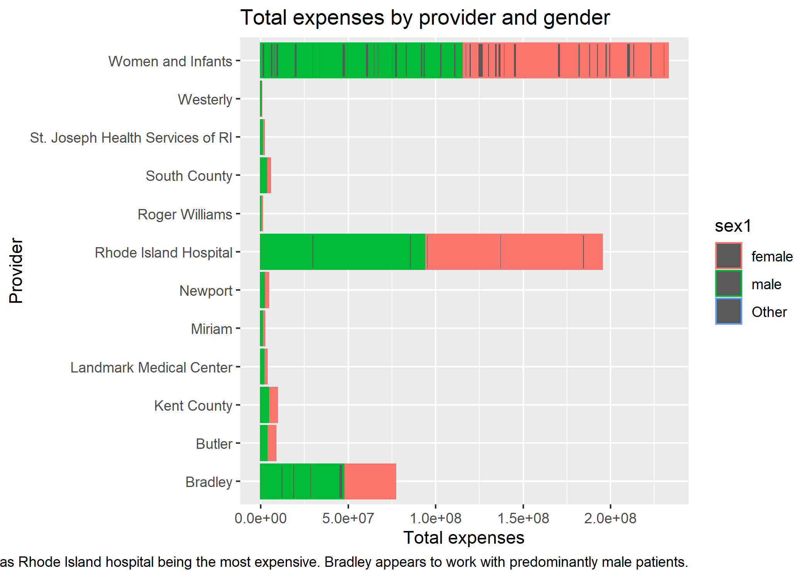
]
---
# Average total expenses by physical therapy location

.left-code[
```{r,eval=FALSE}
graph <- df1  %>% filter(pt_state %in% c("MA", "RI", "CT")) 
graph <- graph %>% group_by(pt_state) %>% summarise(mean = mean(tot))
m10 <- graph %>% ggplot(aes(x = pt_state, y = mean
           ))+
  geom_col()+
  labs(title = 'physical therapy in MA, CT, RI', x = "physical therapy location", y = " average total expenses", caption = "The Average expenses in Massachusetts appear higher than Conneticut or Rhode Island")
m10
ggsave(filename = 'pysical_therapy.png', plot = m10)
```
]
.right-plot[
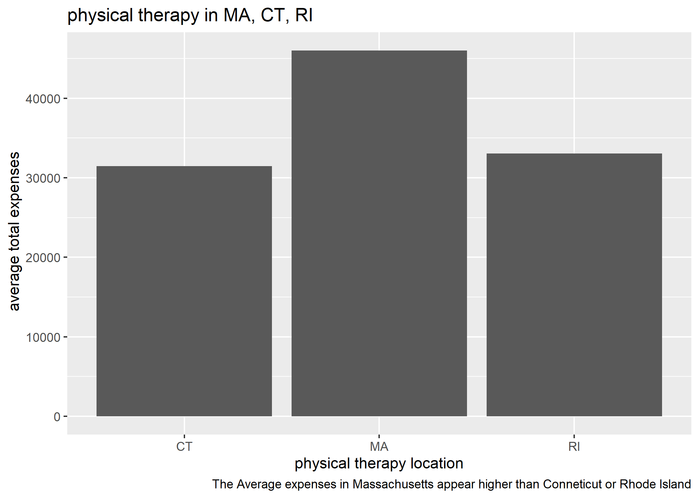
]
---
# Total expenses by hopsital campus

.left-code[
```{r,eval=FALSE}
m2 <- df1 %>% group_by(campus, sex1) %>% summarise(mean = mean(tot)) %>% ggplot(aes(x = campus,
           y = mean, color=sex1))+
  geom_col()+
  labs(title = 'total expenses by Hospital campus', x = "Hospital Campus", y = "Total Expenses", caption = "The total expenses appears to be higher in campus 3 which is Rhode Island Hospital - Adult, this is important to note because the scatter plots we saw showed high expenses with respect to kids.")
m2
ggsave(filename = 'TotbyHos.png', plot = m2)
```
]
.right-plot[
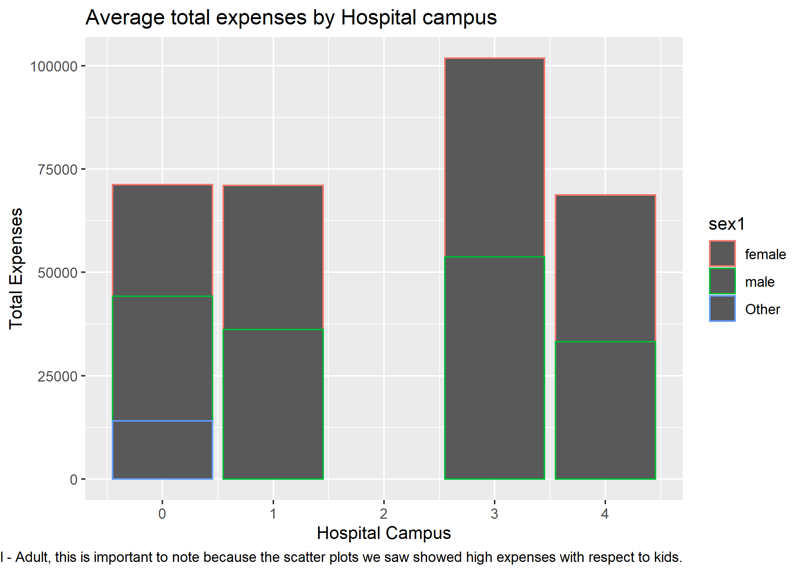
]
---
# Total by Provider

.left-code[
```{r,eval=FALSE}
m9 <- df1 %>% ggplot() + geom_col(mapping=aes(y=provider1,x = tot, fill=season)) +
  labs(x='Total Expenses', 
       y='Provider',
       fill = 'Season', 
       title = 'total expenses by provider and season', 
       caption = 'Rhode Island Hospital shows the highest toal expenses.There appears minimal variation between seasons for each hospital.')
m9
ggsave(filename = 'totvProv.png', plot = m9)
```
]
.right-plot[

]
---
# Month of admition vs Total expenses

.left-code[
```{r,eval=FALSE}
m3 <- df1 %>% ggplot(aes(x = moa,y= tot,
            color=sex1))+
  geom_col()+
  labs(title = 'moa vs total room and board', x = "Month of Admition", y = "Total expenses", caption = "August and October appear to have a higher total cost. This could be due to the increase in patients during these months.")
m3
ggsave(filename = 'Moatrandb.png', plot = m3)
```
]
.right-plot[
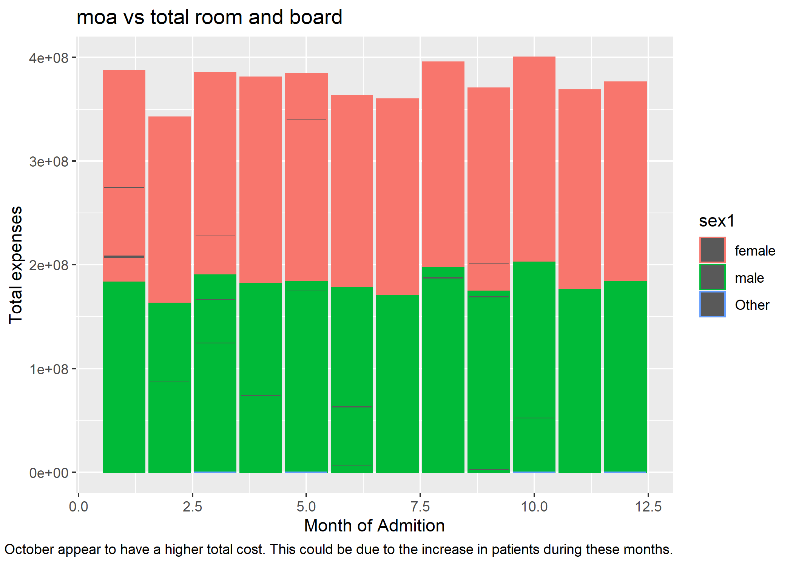
]

---
# Month of admition vs Total expenses

.left-code[
```{r,eval=FALSE}
m3 <- df1 %>% ggplot(aes(x = moa,y= tot,
            color=sex1))+
  geom_col()+
  labs(title = 'moa vs total room and board', x = "Month of Admition", y = "Total expenses", caption = "August and October appear to have a higher total cost. This could be due to the increase in patients during these months.")
m3
ggsave(filename = 'Moatrandb.png', plot = m3)
```
]
.right-plot[
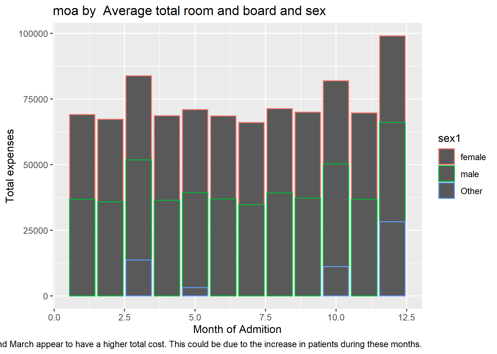
]

---
# Animated plot

.left-code[
```{r,eval=FALSE}
library(gganimate)
library(ggplot2)
df1$avgtot <- case_when(df1$tot >= 34317.18	~"above average",df1$tot <= 34317.18	~ "below average")
df1$trandb <- as.numeric(df1$trandb)
d1 <- df1 %>% group_by(moa,sex1,avgtot,age) %>% summarise(mean = mean(trandb, na.rm=TRUE))

a1 <- d1 %>% ggplot(aes(x=age, y=mean, color = sex1)) + geom_col()+labs(x = "Age",y = "Average Room and Board Cost", title = 'moa {closest_state}',fill = "Sex")+
    transition_states(moa)
animate(a1, nframes = 400)
```
]
.right-plot[
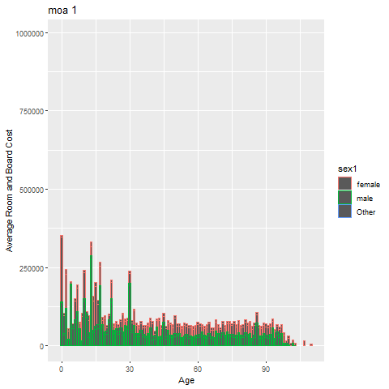
]


---
# Predictive models

```{r,eval=FALSE}
library(tidyverse)
library(dplyr)
df1$tot <- case_when(
  df1$tot <16228	 ~ 'low',
  TRUE ~ 'high'
)
df1 <- df1 %>% rename(target=tot)

df1 <- df1 %>% 
  mutate(target = as.factor(target),)
df2 <- df1 %>% select(age,sex,raceethn,provider,moa,mod,admtype,campus, los,target)
```

```{r,eval=FALSE}
df2 <- df1 %>% select(age,sex,raceethn,provider,moa,mod,admtype,campus, los,target)
```
---
# Create data partition

```{r,eval=FALSE}
library(caret)
set.seed(2020)
df2 <- df2 %>% filter(!raceethn == "")
df2 <- drop_na(df2)
                                            
splitIndex <- createDataPartition(df2$target, p = .1, 
                                  list = FALSE)
df_train <- df2[ splitIndex,]
df_test <- df2[-splitIndex,]
```
---
# Rpart tree


```{r,eval=FALSE}
library(rpart)
tree_model <- rpart(target ~ ., data = df_train,
                 control = rpart.control(maxdepth = 3))
library(rattle)
fancyRpartPlot(tree_model)
tree_model$variable.importance
##        los    admtype        age   provider     campus raceethn 
## 1280.12651  431.30612  419.30831  351.39954   58.83157   47.76413
barplot(tree_model$variable.importance)
pred <- predict(tree_model, df_test, type = "class")
cm <- confusionMatrix(data = pred, reference = df_test$target)
cm$overall[1]
```
---
# Rpart tree cont.


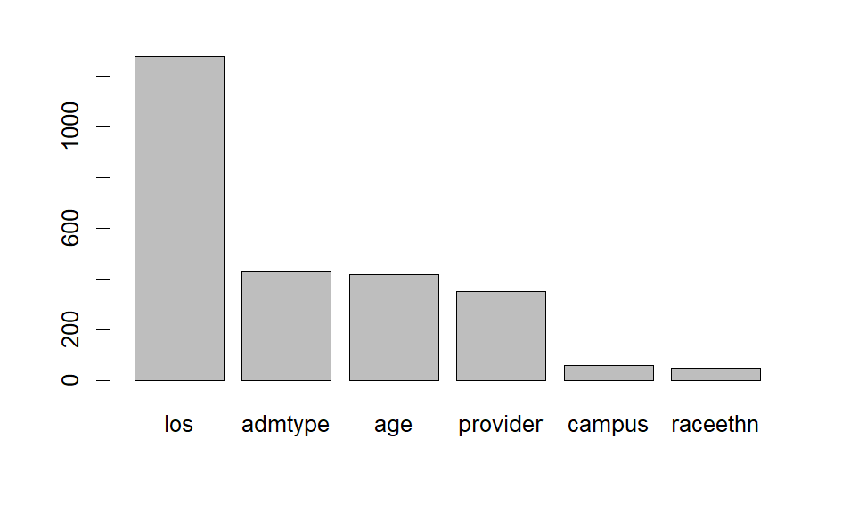
---
# Rpart tree cont.
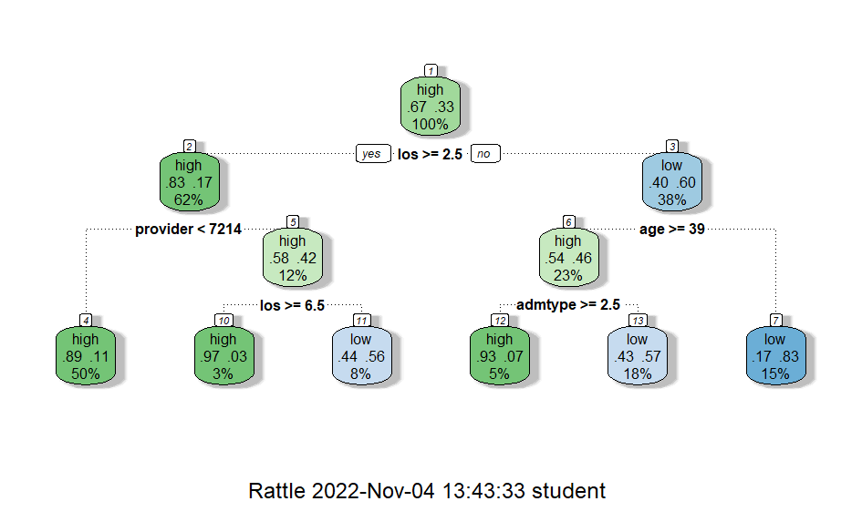


---
# Additional model 1(Rpart2)


```{r,eval=FALSE}
library(caret)

tuneGrid = expand.grid(maxdepth = 2:10)

trControl = trainControl(method = "cv",
                         number = 5)

tree_approach2 <- train(target~., data=df_train, 
                                method = "rpart2", 
                                trControl = trControl,
                                tuneGrid = tuneGrid)

```

---
# Additional model 2(Ranger)


```{r,eval=FALSE}
library(caret)
tuneGrid = expand.grid(mtry = 2:4,
                       splitrule = c('gini'),
                       min.node.size = c(1:10))

trControl = trainControl(method = "cv",
                         number = 5)

tree_approach3 <- train(target~., data=df_train, 
                                method = "ranger", 
                                trControl = trControl,
                                tuneGrid = tuneGrid)

```

---
# Model comparison Rpart2

.left-code[
```{r,eval=FALSE}
bwplot(resamples(list('RPart2' = tree_approach2,
                      'Ranger' = tree_approach3
                          )))
```

]
.right-plot[
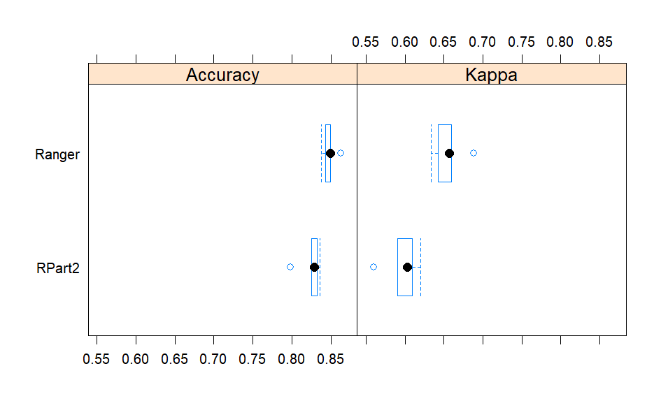
]
---
# Model comparison Ranger

.left-code[
```{r,eval=FALSE}
library(caret)
set.seed(2020) 
df2 <- df2 %>% filter(!raceethn=='',!admtype=='') 
splitIndex <- createDataPartition(df2$target1, p = .10, 
                                  list = FALSE)
df_train <- df2[ splitIndex,]
df_test <- df2[-splitIndex,]

tuneGrid = expand.grid(maxdepth = 2:10)

trControl = trainControl(method = "cv",
                         number = 5)

tree_approach4 <- train(target1~., data=df_train, 
                                method = "rpart2", 
                                trControl = trControl,
                                tuneGrid = tuneGrid)
plot(tree_approach4)
print(tree_approach4)
pred <- predict(tree_approach4, df_test)
cm4 <- confusionMatrix(data = pred, reference = df_test$target1)
cm4$overall[1]

```
-Accuracy 
-0.5828897 
]
.right-plot[
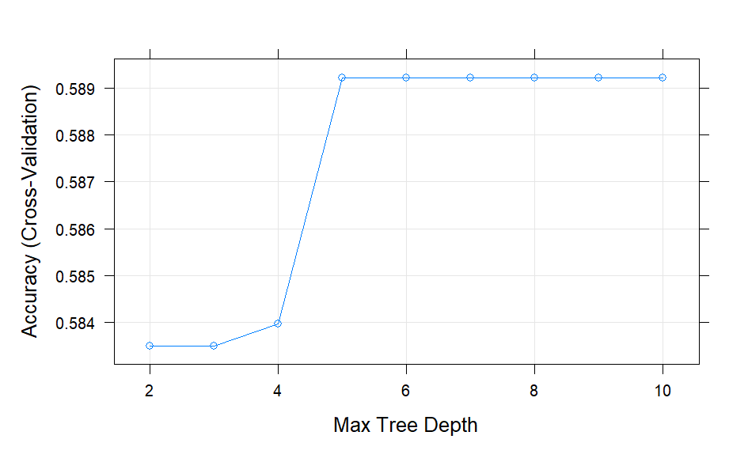
]
---
# Model comparison Rpart2

.left-code[


]
.right-plot[

]