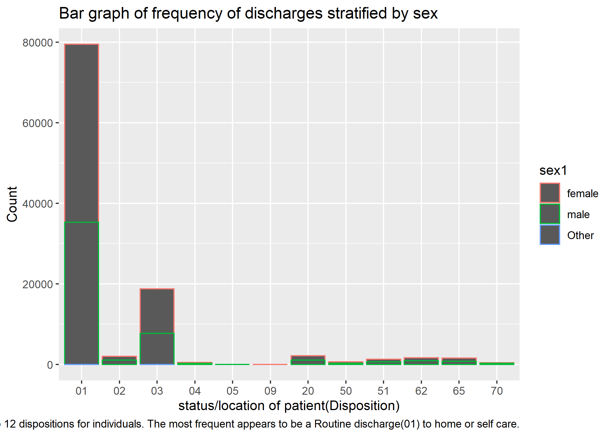
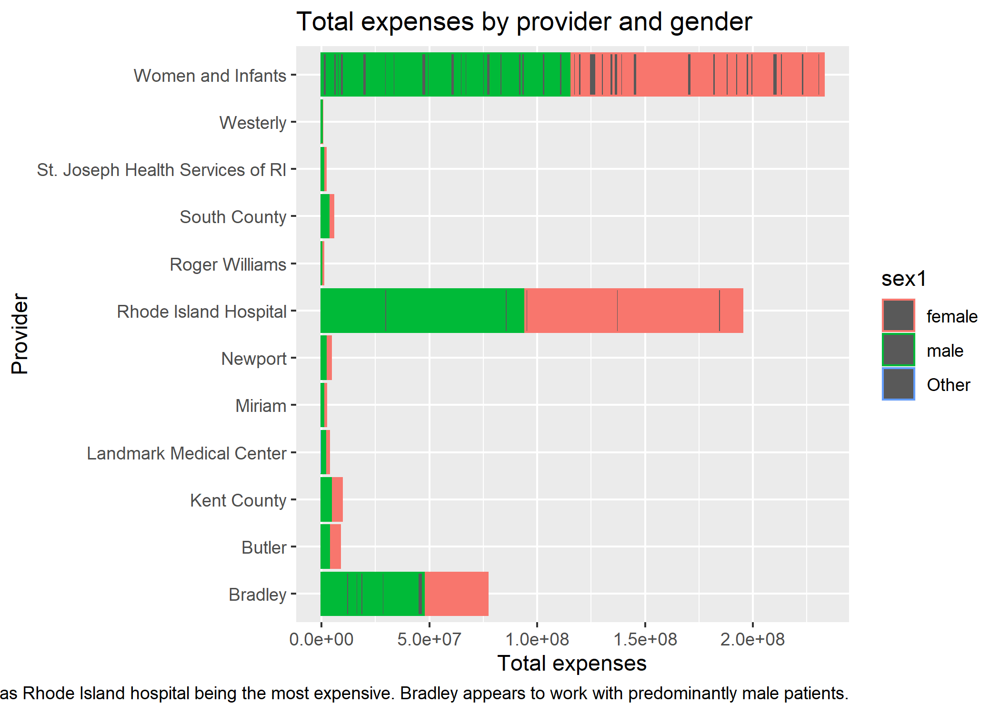

```{r setup, include=FALSE}
knitr::opts_chunk$set()
```

---
## Renaming Variables
-defining sex variable

```{r,eval=FALSE}
df1$sex1 <- case_when(df1$sex == 1 ~ 'male',
                      df1$sex == 2 ~ 'female', 
                      df1$sex == 9 ~'Other')
```


-defining providers by name
```{r,eval=FALSE}
df1$provider1 <- case_when(df1$provider == 7201 ~ "Newport", df1$provider == 7202 ~ "St. Joseph Health Services of RI",df1$provider == 7203 ~ "Memorial",df1$provider == 7204 ~ "Miriam",df1$provider == 7205 ~ "Rhode Island Hospital",df1$provider == 7206 ~ "Roger Williams",df1$provider == 7209 ~ "South County",df1$provider == 7210 ~ "Kent County",df1$provider == 7211 ~ "Westerly",df1$provider == 7212 ~ "Rehab of RI",df1$provider == 7213 ~ "Landmark Medical Center",df1$provider == 7214 ~ "Women and Infants",df1$provider == 7215 ~ "Bradley",df1$provider == 7216 ~ "Butler",)
```

---
## Slide with Bullets

{width=50%}
---
## Total Expenses by Age and Sex

{width=50%}
---
## Length of stay by age

{width=50%}

---
##Length of stay and provider

{width=50%}

---
##Length of stay and provider for teenagers

{width=50%}
---
##Average total expenses by physical therapy in local states

{width=50%}
---
##Total by Hospital

{width=50%}

---
##Total by provider

{width=50%}